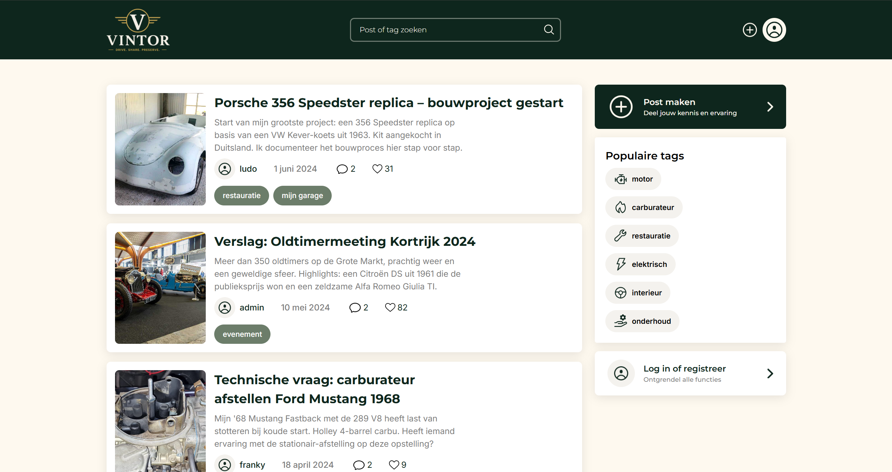

# Vintor

## Inhoudsopgave

1. [Inleiding](#inleiding)
2. [Screenshot](#screenshot)
3. [Benodigdheden](#benodigdheden)
4. [De applicatie draaien](#de-applicatie-draaien)
5. [Overige commando's](#overige-npm-commandos)
6. [Testgebruikers](#testgebruikers)

## Inleiding

Vintor is een community-platform voor liefhebbers van oldtimers en klassiekers. Gebruikers plaatsen posts over onderwerpen zoals motor, carburateur, restauratie, elektrisch, interieur en onderhoud, en gaan met elkaar in gesprek via reacties.

Belangrijkste functionaliteiten:

- Overzicht van alle posts op de homepagina, met titel, beschrijving, auteur, datum, tags en aantal likes/reacties.
- Posts zoeken op titel, beschrijving of tag via de zoekbalk.
- Populaire tags in de zijbalk als snelkoppeling naar gefilterde zoekresultaten.
- Detailpagina per post met een afbeeldingencarrousel, like-functionaliteit en reacties.
- Registreren en inloggen; ingelogde gebruikers kunnen reageren op posts.
- Nieuwe posts aanmaken met titel, beschrijving, tags (max. 2) en afbeeldingen (max. 5, elk max. 2MB).
- Eigen posts beheren (bewerken) via "Mijn posts".

## Screenshot

Homepagina



## Benodigdheden

- **React 19** — library voor het bouwen van de UI met componenten.
- **Vite** — build tool en development server.
- **React Router DOM** — routering tussen pagina's (Home, Login, Registreren, Zoeken, Post, Mijn posts, Nieuwe post, Post aanpassen).
- **Axios** — HTTP-client voor communicatie met de backend-API.
- **JWT Decode** — uitlezen van de gebruikersgegevens in het JSON Web Token na het inloggen.
- **React Select** — dropdown-component voor het selecteren van tags bij het aanmaken van een post.
- **Swiper** — afbeeldingencarrousel op de postdetailpagina.
- **Fuse.js** — fuzzy search, gebruikt voor het zoeken naar posts.
- **Node.js** — (versie 18 of hoger) inclusief npm.

De applicatie communiceert met de gedeelde NOVI-backend-API, die niet in deze repository zit en apart draait.

## De applicatie draaien

### Stappen

1. **Repository clonen of downloaden**

   ```bash
   git clone https://github.com/ArthurDepuydt/eindopdracht-frontend-vintor
   cd Vintor
   ```

2. **Dependencies installeren**

   ```bash
   npm install
   ```

3. **Omgevingsvariabelen configureren**

   Maak in de root van het project een bestand aan met de naam `.env` en vul het volgende in:

   ```env
   VITE_API_BASE_URL=https://novi-backend-api-wgsgz.ondigitalocean.app/api
   VITE_API_DOMAIN=https://novi-backend-api-wgsgz.ondigitalocean.app
   VITE_API_PROJECT_ID=<jouw-api-key>
   ```

   - `VITE_API_BASE_URL` — basis-URL van de API-endpoints (login, posts, comments, ...).
   - `VITE_API_DOMAIN` — domein van de backend, gebruikt om afbeeldingen op te bouwen die de API teruggeeft.
   - `VITE_API_PROJECT_ID` — het project-ID dat hoort bij de NOVI-backend, meegestuurd als header bij elk API-verzoek.

4. **Applicatie starten**

   ```bash
   npm run dev
   ```

   De applicatie is vervolgens bereikbaar via de URL die in de terminal verschijnt.

## Overige npm-commando's

Naast `npm install` en `npm run dev` zijn de volgende commando's beschikbaar:

```bash
npm run build    # Bouwt een geoptimaliseerde productieversie van de applicatie in de map dist
npm run preview  # Start een lokale server die de build uit dist serveert
npm run lint     # Controleert de broncode met ESLint op codeerfouten en stijlproblemen
```

## Testgebruikers

Er is een bestaand test-account beschikbaar om de applicatie uit te proberen:

- **E-mailadres:** `ludo@oldtimerclub.be`
- **Wachtwoord:** `ludo1234`

Je kan ook zelf een nieuw account aanmaken via de registratiepagina.
